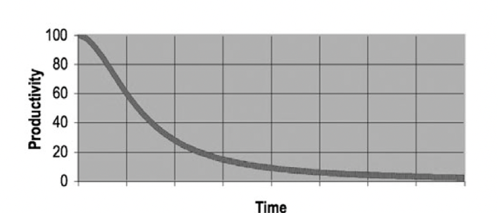
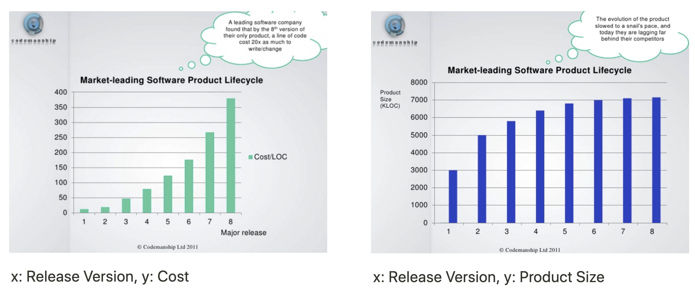

# Chapter 1 : 깨끗한 코드

## 코드가 존재하리라

> 기계가 실행할 정도로 상세하게 요구사항을 명시하는 작업이 프로그래밍이고, 그 결과가 코드이다. 이 코드는 사라지지 않는다.

프로그래밍 언어에서 추상화 수준은 점점 높아지고있고, 특정 분야에 적합한 domain-specified-language가 늘어나고 있어다.
하지만, 그래도 코드는 사라지지 않는다.

어떤 언어를 사용하던 기계가 이해하고 실행할 정도로 엄밀하고 정확하고 상세하고 정형화해야한다.

코드는 결국 요구사항을 표현하는 언어이고, 그것을 표현하는 어느 순간에는 정밀한 표현이 필요하다. 그 필요성을 없앨 수 없기 떄문에 코드는 사라질 수 없다.

## 나쁜 코드

어떠한 앱을 개발하여 대박이 난 회사도 나쁜 코드로 인하여 회사가 망했다.
코드가 망가지면 망가질수록 뒷감당이 불가능해진다.

=> 나쁜 코드를 방치하고 "나중에 정리하자"라고 생각하지말자. 나중은 절대오지 않는다. ( 르블라의 법칙 )

## 나쁜 코드로 치르는 대가

나쁜 코드는 개발 속도를 크게 떨어뜨린다.

나쁜 코드가 쌓일수록 팀 생산성은 떨어지며, 마침내 0에 근접한다.



- 추가내용 )
  소프트웨어가 출시되고 시간이 지나면 지날수록 한 줄의 코드를 변경하는데 높은 비용이 든다는 것이 통계적으로 알려져있다.

비용은 증가하지만, 코드의 변화는 크게 없다는 것을 오른쪽 그래프에서 알 수 있음.



이렇기 떄문에, 당장 나쁜코드가 아닌 코드로 이루어진 소프트웨어도 코드 분석 및 변경에 오래걸린다는 것을 알 수 있다.

=> 그런데, 여기에 코드까지 나쁘다면?..

### 원대한 재설계의 꿈

이러한 나쁜 코드를 고치는 방법으로는, 처음부터 다시 시작하는 재설계가 있다.

재설계를하게 된다면, 기존의 시스템 팀과 재설계 팀의 경주가 시작된다.

재설계 팀은 기존 시스템과 완벽히 일치하는 동작을 하는 새로운 시스템을 만들면서, 기존 시스템에 가해지는 변경들도 계속 따라잡아야한다.

이 재설계가 10년이 넘게 걸리는 경우도 존재한다.

여기서, 이 재설계 팀이 기존 프로젝트를 거의 따라잡을 때 쯤.. 재설계 팀의 초기 멤버는 대부분 새로운 사람으로 교체되고, 그 사람들은 현재 시스템이 너무 엉망이라며 다시 재설계를하자고 나선다..

=> Clean Code를 작성하는 것이 얼마나 비용을 절감시켜주고, 전문가로써 살아남는 길인지를 보여주는 예시.

### 태도

- 몇 시간으로 예상한 업무가 몇 주로 늘어나고, 몇 줄만 고치면 되리라 생각했던 것이 수백 개의 모듈을 건드리게 되는 경우가 흔하다.
  - 좋은 코드가 왜 이렇게 빠르게 나쁜 코드로 바뀌어가는가?
- 설계가 변해서, 관리자가 멍청해서, 마케팅 부서 탓으로 돌리는 경우가 많다.
  - 하지만, 결국 이 모든 것은 프로그래머 탓이다.
  - 관리자는 일정에 쫓기더라도 대부분 좋은 코드를 원한다.
  - 이러한 좋은 코드를 사수하는 것은 우리의 책임이다.

> 나쁜 코드의 위험을 이해하지 못하고, 관리자의 말을 그대로 따라가는 행동은 전문가답지 못하다.

### 원초적 난제

- 대부분의 프로그래머는 나쁜 코드가 업무속도에 영향을 주지만, 빠르게 개발하려면 나쁜 코드를 양산할 수 밖에 없다고 생각한다.
- 하지만 진짜 전문가들은 나쁜 코드를 양산하게 되면 결국 기한에 못맞추게 된다는 것을 안다.

> 기한을 맞추는 유일한 습관은, 언제나 코드를 깨끗하게 유지하는 것

### 깨끗한 코드라는 예술?

- 깨끗한 코드를 작성하기 위해서는 "청결"이라는 코드 감각이 필요하다.
- 이 코드 감각은 나쁜 모듈을 보면 좋은 모듈로 개선할 방안을 떠올리는 것이다.

> 이러한 코드 감각을 사용해 우리는 클린 코드를 작성해야한다.

### 깨끗한 코드란?

- Bjarne Stroustrup
  - 우아하고 효율적인 코드
  - 논리는 간단해야하고 의존성은 최대한 줄여야한다.

### 보이스카우트 규칙

- 잘 짠 코드만이 전부가 아니다. 이 코드를 시간이 지나도 깨끗하게 유지하는 것이 중요하다.

> 캠프장은 처음왔을 때보다 더 깨끗하게 해놓고 떠나라.

- 위 규칙을 언제나 생각하고, 조금씩 코드를 개선해나가면서 시간이 지날수록 코드가 더 좋아지도록 해야한다.

### 프리퀄과 원칙

이 책은 저자가 2002년에 쓴 책 Agile Software Development: Principles, Patterns, and Practices (PPP) 의 프리퀄이라 할 수 있다.

SRP, OCP, DIP등 PPP에서 설명하는 객체지향 디자인의 원칙과 실제에 대한 설명이 종종 나오기 때문에, 클린 코드를 일고나서 읽어보면 좋을 것이다.

### 결론

이 책은 우리를 클린 코드를 작성하는 예술가로 만들어 줄 것이라는 보장이 없다.

단지, 진짜 전문가들이 사용하는 도구와 기법, 생각하는 방식을 소개할 뿐이다.

> 우리가 진짜 예술가가 되려면, 이 책을 단순히 읽고 끝내지 않고 실제로 연습을 통해 예술가들이 사용하는 방법에 익숙해지도록 하자.

# Chapter 2 : 의미 있는 이름

## Introduction

소프트웨어에서 이름은 어디에나 사용된다. 변수에도 사용되고, 함수에도 사용된다.

또한, 소스 파일에도 이름이 사용되며 디렉터리에도 이름이 사용된다.

> 이렇듯 많은 곳에서 이름을 사용하게 되므로, 이름을 잘 지으면 여러모로 편하다.

## 의도를 분명히 밝혀라

> 이름을 지을 때 항상 의도를 명확히 할 수 있는 이름을 지어라.

```java
int d; // 경과한 시간. ( 날짜 ) => 아무 의미가 없는 이름을 어떻게 바꾸면 좋을까?

// 바꾼 이름 => 훨씬 의도를 분명히 드러낸다.
int elapsedTimeDays;
int daysSinceCreation;
int daysSinceModification;
int fileAgeInDays;
```

```java
public List<int[]> getThem(){
  List<int[]> list1 = new ArrayList<>();
  for(int[] x: theList){
    if(x[0] == 4){
      list1.add(x);
    }
  }

  return list1;
}
```

위 코드를 보고 무슨일을 하는지 짐작할 수 있나? 어렵다.

코드의 맥락이 명시적으로 드러나지 못하기에, 이 코드는 정말 좋지 않다.

```java
public List<int[]> getFlaggedCell(){
  List<int[]> flagedCells = new ArrayList<>();
  for(int[] cell: gameBoard){
    if(cell[STATUS_VALUE] == 4){
      flagedCells.add(cell);
    }
  }

  return flagedCells;
}
```

다시 위의 새로운 코드를 보자.

처음 제시했던 코드와 동작은 같지만, 변수명이 다르고 이걸 통해 우리는 코드의 의미를 확실히 할 수 있다.

여기서 한걸음 더 나아가, 칸을 단순한 클래스로 만들어서 아래와 같이 바꾼다면 누구나 한 번 보고 "게임에서 flag가 set 된 cell들의 List를 return 한다는 것을 알 것이다."

```java
public List<Cell> getFlaggedCell(){
  List<Cell> flagedCells = new ArrayList<>();
  for(Cell cell: gameBoard){
    if(cell.isFlagged()){
      flagedCells.add(cell);
    }
  }

  return flagedCells;
}
```

## 그릇된 정보를 피하라

> 프로그래머는 코드에 그릇된 단서를 남기면 안된다.

- 이미 다른 의미로 널리 사용되고 있는 단어를 다른 의미로 변수에 사용한다거나, 특수한 의미를 가지는 이름을 다르게 사용하지말자.

- 서로 흡사한 이름을 사용하지 않도록하자. ( `XYZControllerForEfficentHandlingOfStrings` <-> `XYZControllerForEfficentStorageOfStrings` )

- 유사한 개념은 유사한 표기법을 사용하자. 이러한 것도 정보로 다른 사람에게 파악될 수 잇고, 일관성이 떨어지게 되면 이것도 결국 그릇된 정보이다.
  => 여러 IDE의 자동완성 네이밍 추천기능을 사용하면 이러한 것에서 굉장히 유용하게 사용할 수 있다.

- 잘못알아보기 쉬운 알파벳을 사용할 때 주의하자. ( 소문자 L 혹은 숫자 1 과 같이 구분이 어려운 것들. )
  => 개인적으로는, 이런 것을 위해 코딩용 폰트를 사용하는 것이 제일 괜찮은 방법인 것 같다.

## 의미 있게 구분하라.

> 컴파일러나 인터프리터만 통과하는 코드는 작성하지 말자. 이것을 결국 문제를 일으킨다.

- 같은 범위에 있는 다른 개념은 같은 이름을 사용하지 못한다. 이걸 해결하려고 한 쪽 이름을 마음대로 바꿔서 의미를 퇴색시키지 말자.
- 컴파일러를 통과하기위해 연속된 숫자를 붙이거나 noise word 같은 것을 추가하는 방식을 적절치 못하다.

  - 아래와 같이 a1, a2와 같은 변수를 사용하는 코드는 정보를 제공하지못하고, 의도도 드러내지 못한다.

    ```java
    public static void copyChars(char a1[], char a2[]){
      for(int i=0;  i<a1.length; ++i){
        a2[i] = a1[i];
      }
    }
    ```

    이걸 어떻게 좀 더 의미를 드러내게 코드를 짤 수 있을까?
    예를 들어, a1을 source, a2를 destination이라는 변수명으로 바꾼다면, 좀 더 읽기 쉽고 의도도 분명히 드러낼 수 있을 것이다.

  - 불용어를 추가한 이름도 결국 아무런 정보를 제공하지 못한다. ProductInfo, ProductData와 같은 클래스들을 보면 이 클래스들은 개념을 구분하지 않은 채 이름만 달리한 경우이다.
    아래의 코드를 보자.

    ```java
    getActiveAccount();
    getActiveAccounts();
    getActiveAccountInfo();
    ```

    위 세 함수중 도대체 무엇을 호출해야 고객 급여 이력을 찾을 수 있을까? 이러한 불용어를 추가하는 것은 결국 의도를 드러내지 못한다.

    읽는 사람이 차이를 알도록 이름을 짓자.

## 발음하기 쉬운 이름을 사용하라.

> 사람들은 단어에 능숙하고, 단어는 발음이 가능해야한다. 발음하기 쉬운 이름을 택할 수록 두뇌는 더 쉽게 이를 받아들인다.

아래 코드를 보자 어떤 쪽이 더 이해가 잘되고, 소통에 편리할까?
당연히 후자다. 그렇기에 발음하기 쉬운 이름을 사용하자.

```java
class DataRcrd102 {
  private Date genymdhms;
  private Date modymdhms;
  private final String pszqint = "102";
}

class Customer {
  private Date generationTimeStamp;
  private Date modificationTimeStamp;
  private final String recordId = "102";
}
```

## 검색하기 쉬운 이름을 사용하라

> 문자 하나를 사용하는 이름과 상수는 텍스트 코드에서 쉽게 눈이 띄지 않는다.

숫자 7, 영문자 e와 같은 변수명은 검색을하게 되면 어딘가에 이것을 포함하는 변수명과 같은 것들이 있고 이것은 검색에 어려움을 준다.

그리고 상수는 쉽게 오타를 낼 수 있고, 쉽게 찾기 어려운 버그를 발생시키는 주 원인이다.

```java
for(int j=0;j<34;++j){
  s += (t[j]*4)/5;
}
```

위 코드와 아래 코드는 어떤가?

```java
int realDaysPerIdealDay = 4;
const int WORK_DAYS_PER_WEEK = 5;
int sum = 0;
for(int j=0; j< NUMBER_OF_TASKS; ++j){
  int realTaskDays = taskEstimate[j] * realDaysPerIdealDay;
  int realTaskWeeks = realTaskDays / WORK_DAYS_PER_WEEK;
  sum += realTasksWeeks;
}
```

최소한 검색이 가능한 변수들로 이루어져 있다. 이러한 이름을 사용하자.

## 인코딩을 피해라

> 변수에 부가적인 정보를 덧붙여서 표기하지 말자.

- 헝가리안 표기법
  - 변수명에 해당 변수의 타입(String, Int 등)을 적지 말자
- 멤버 변수 접두어
  - 멤버 변수 접두어를 붙이지 말자
- 인터페이스와 구현
  - 인터페이스 클래스와 구현 클래스를 나눠야 한다면 구현 클래스의 이름에 정보를 인코딩하자.

## 자신의 기억력을 자랑하지마라

> 일반적으로 문제 영역이나 해법 영역에서 사용하지 않는 이름을 선택하지 말자.

- 문자 하나만 사용하는 변수 이름은 문제가 있다. ( 루프에서 사용하는 변수 제외 ) 다른 사람이 한 문자의 변수를 읽었을 때 무슨의미인지 해석하는 과정이 발생해야하며, 이것은 결국 의도를 드러내지 못한다.

- 또한, 쉽게 파악되지 않는 이름을 사용하지 말자. r이라는 변수가 호스트와 프로토콜을 제외한 소문자 URL이라는 사실을 항상 기억할 수 있는가? 어렵다.

전문가인 프로그래머는 명료함이 최고라는 것을 이해한다. 그렇기에 자신의 능력을 좋은 방향으로 사용해 남들이 이해하는 코드를 내놓는다.

## 클래스 이름

> 클래스 이름과 객체 이름은 명사나 명사구가 적합하다.

Customer, WikiPage, Account와 같은 것은 좋은 예이다.

Manager, Processor, Data, Info 같은 단어는 피하고 동사는 사용하지 말자.

## 메서드 이름

> 메서드 이름은 동사나 동사구가 적합하다.

postPayment, deletePage, save 등은 좋은 예이다.

접근자, 변경자, 조건자 등은 표준에 따라 get set is 등을 사용하자.

Constructor를 overload 할 때는 정적 팩토리 메소드를 사용하자. 메서드는 인수를 설명하는 이름을 사용하자.

```java
Complex fulcrumPoint = Complex.fromRealNumber(23.0);
Complex fulcrumPoint = new Complex(23.0);
```

아래 코드보다 위 코드가 낫다.

생성자 사용을 제한하려면, private으로 선언하자.

## 기발한 이름은 피하라

> 저자와 유사한 유머코드를 갖는 사람만 이러한 이름을 기억한다. 피하자.

HolyHandGrenade 라는 이름을 다른 사람이 보고 어떻게 이해할까? deleteItem과 같은 메서드 이름이 더 낫다.

또한, 특정문화에서만 사용하는 농담같은 것들도 피하는 것이 좋다.

의도를 분명하고 솔직하게 표현하자.

## 한 개념에 한 단어를 사용하라.

> 추상적인 개념 하나에 단어 하나를 선택해 이를 고수하자.

똑같은 메서드를 클래스마다 fetch, get, retrieve와 같이 구분하여 사용하게 되면, 나중에 혼란을 야기한다.

여러 IDE들이 문맥에 맞는 단서를 제공하고, 객체의 메서드 목록들을 제공한다지만 주석을 뒤져보지 않고 프로그래머가 올바르게 메서드를 선택하도록 한 개념에 한 단어를 사용하자.

일관성이 있는 어휘 사용은 프로그래머에게 도움을 준다.

## 말장난을 하지 마라

> 한 단어를 두 가지 목적으로 사용하지마라. 다른 개념에 같은 단어를 사용하면 그것은 말 장난에 불가하다.

예를 들어, 여러 클래스에 add라는 메서드를 추가했다고 가정하자. 모든 add 메서드의 매개변수와 반환값이 의미적으로 똑같다면 문제가 없다.

하지만, 같은 맥락이 아닌데도 일관성을 지킨다며 다른 동작을 하는 메서드의 이름을 add로 하는 것은 괜찮은가? 이것은 결국 말장난이다.

프로그래머는 코드를 최대한 이해하기 쉽게짜야하며, 의도를 제대로 밝혀야한다.

## 해법 영역에서 가져온 이름을 사용해라.

> 코드를 읽을 사람도 프로그래머라는 사실을 명심하자. 대부분 전산지식을 가지고 있을 것이고, 수학용어를 알고 있을 것이다. 하지만 모든이름을 문제 영역에서 가져오는 것은 좋지 않다.

같은 개념을 다른이름으로 이해하던 동료들이 매번 고객들에게 의미를 물어봐야하기 때문이다.

기술 개념에는 기술 이름이 가장 적합한 선택이다.

## 문제 영역에서 가져온 이름을 사용하라

> 적절한 프로그래머 용어가 없다면 문제 영역에서 이름을 가져오자.

이를 통해 프로그래머가 전문가에게 의미를 물어 의미를 파악할 수 있다.

문제영역과 해법영역을 잘 구분하고, 문제 영역 개념과 관련이 깊다면 문제 영역에서 이름을 가져와야한다.

## 의미있는 맥락을 추가하라.

> 스스로 의미가 분명한 이름이 없지 않다. 그래서 클래스, 함수, 이름 공간에 감싸서 맥락을 부여하자. 모든 방법이 실패하면 마지막 수단으로 접두어를 붙이자.

```java
// 나쁨
private void printGuessStatistics(char candidate, int count) {
    String number;
    String verb;
    String pluralModifier;
    if (count == 0) {
        number = "no";
        verb = "are";
        pluralModifier = "s";
    }  else if (count == 1) {
        number = "1";
        verb = "is";
        pluralModifier = "";
    }  else {
        number = Integer.toString(count);
        verb = "are";
        pluralModifier = "s";
    }
    String guessMessage = String.format("There %s %s %s%s", verb, number, candidate, pluralModifier );

    print(guessMessage);
}

// 좋음
public class GuessStatisticsMessage {
    private String number;
    private String verb;
    private String pluralModifier;

    public String make(char candidate, int count) {
        createPluralDependentMessageParts(count);
        return String.format("There %s %s %s%s", verb, number, candidate, pluralModifier );
    }

    private void createPluralDependentMessageParts(int count) {
        if (count == 0) {
            thereAreNoLetters();
        } else if (count == 1) {
            thereIsOneLetter();
        } else {
            thereAreManyLetters(count);
        }
    }

    private void thereAreManyLetters(int count) {
        number = Integer.toString(count);
        verb = "are";
        pluralModifier = "s";
    }

    private void thereIsOneLetter() {
        number = "1";
        verb = "is";
        pluralModifier = "";
    }

    private void thereAreNoLetters() {
        number = "no";
        verb = "are";
        pluralModifier = "s";
    }
}

```

## 불필요한 맥락을 없애자.

> Gas Station Delux 이라는 어플리케이션을 작성한다고 해서 클래스 이름의 앞에 GSD를 붙이지는 말자. G를 입력하고 IDE의 자동완성을 누를 경우 모든 클래스가 나타나는 등 효율적이지 못하다.

위의 예처럼 접두어를 붙이는 것은 모듈의 재사용에서도 좋지않은 명명법이다.

재사용하기 위해 불필요한 맥락을 없애자.
